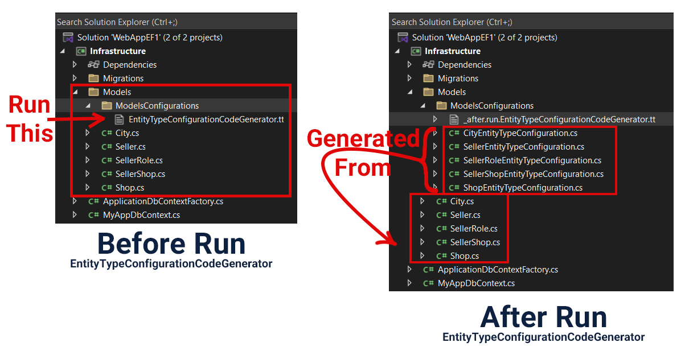

# EntityTypeConfigurationCodeGenerator
T4 template that auto-generates Entity Framework configuration files for all your models. Scans .cs files and creates standardized IEntityTypeConfiguration classes. Saves hours of manual coding with consistent, maintainable results. Perfect for teams and large projects.

## Features

- ⚡ **Auto-discovery** - Scans all .cs files in your project(in model directory)
- 🎯 **Standardized output** - Consistent naming and structure
- 🚀 **Time-saving** - Generates dozens of configurations in seconds
- 🔧 **Maintainable** - Easy to update across all models

## Quick Start

1. Add the `.tt` file to your Infrastructure project
2. Right-click and select **Run Custom Tool**
3. All configuration files will be generated automatically

## Generated Output

For each model class (e.g., `Product`), the template creates:
- `ProductEntityTypeConfiguration.cs`
- Implements `IEntityTypeConfiguration<Product>`
- Ready for your custom configuration rules

## Perfect For

- Enterprise applications with complex data models
- Teams requiring coding standards
- Projects with numerous entities
- Rapid prototyping and development

## Requirements

- .NET Project with Entity Framework Core
- Visual Studio with T4 support
- Models in .cs files

---

**Save hours of repetitive coding with automated configuration generation!**
